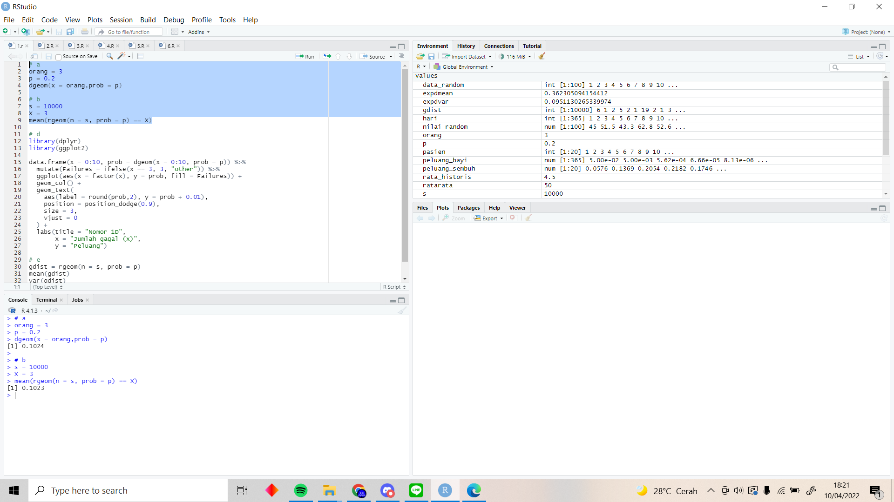

# P1_Probstat_D_5025201178
Nama: Ridzki Raihan Alfaza
NRP: 5025201178
Kelas Probstat D
## 1
### a
``` r
orang = 3
p = 0.2
dgeom(x = orang,prob = p)
```
memakai fungsi `dgeom` untuk mendapat hasil dari distribusi normal pada x = 3

### b
``` r
s = 10000
X = 3
mean(rgeom(n = s, prob = p) == X)
```
memnggunakan fungsi `rgeom` untuk mendapat distribusi geometrik 10000 data acak lalu mendapatkan rata rata dengan fungsi `mean`



### c
dari data hasil a dan b, dapat dilihat bahwa kedua hasil lumayan dekat. ini dikarenakan jumlah data b yang lumayan banyak yaitu n = 10000 sehingga rata rata dari distribusi nilai acak pada b mendekati nilai seharusnya yaitu hasil dari poin a.

### d
``` r
library(dplyr)
library(ggplot2)

data.frame(x = 0:10, prob = dgeom(x = 0:10, prob = p)) %>%
  mutate(Failures = ifelse(x == 3, 3, "other")) %>%
  ggplot(aes(x = factor(x), y = prob, fill = Failures)) +
  geom_col() +
  geom_text(
    aes(label = round(prob,2), y = prob + 0.01),
    position = position_dodge(0.9),
    size = 3,
    vjust = 0
  ) +
  labs(title = "Nomor 1D",
       x = "Jumlah gagal (x)",
       y = "Peluang") 
```
poin d menggunakan library dplyr untuk dapat mutasi tabel pada x = 3, dan juga ggplot2 untuk menggambarkan plot. sumbu x pada plot bernilai 0 sampai 10 sebagai perbandingan x = 3 terhadap x = 1 sampai 10, sumbu y pada plot bernilai probabilitas x kali gagal menggunakan distribusi geometrik
source: https://rpubs.com/mpfoley73/458721
### e
``` r
gdist = rgeom(n = s, prob = p)
mean(gdist)
var(gdist)
```
mencari rerata dengan fungsi `mean` dan variasi dengan fungsi `var`
  