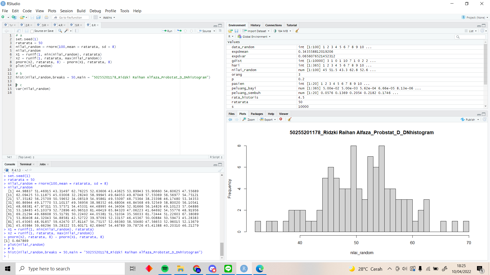
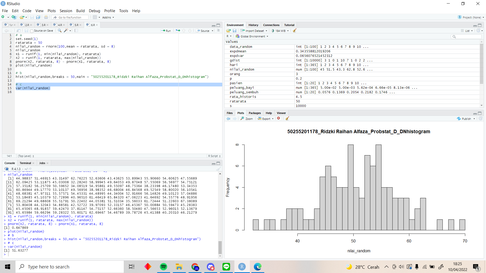

# P1_Probstat_D_5025201178
Nama: Ridzki Raihan Alfaza
NRP: 5025201178
Kelas Probstat D
## 1
### a
``` r
orang = 3
p = 0.2
dgeom(x = orang,prob = p)
```
memakai fungsi `dgeom` untuk mendapat hasil dari distribusi normal pada x = 3

### b
``` r
s = 10000
X = 3
mean(rgeom(n = s, prob = p) == X)
```
memnggunakan fungsi `rgeom` untuk mendapat distribusi geometrik 10000 data acak lalu mendapatkan rata rata dengan fungsi `mean`


### c
dari data hasil a dan b, dapat dilihat bahwa kedua hasil lumayan dekat. ini dikarenakan jumlah data b yang lumayan banyak yaitu n = 10000 sehingga rata rata dari distribusi nilai acak pada b mendekati nilai seharusnya yaitu hasil dari poin a.

### d
``` r
library(dplyr)
library(ggplot2)

data.frame(x = 0:10, prob = dgeom(x = 0:10, prob = p)) %>%
  mutate(Failures = ifelse(x == 3, 3, "other")) %>%
  ggplot(aes(x = factor(x), y = prob, fill = Failures)) +
  geom_col() +
  geom_text(
    aes(label = round(prob,2), y = prob + 0.01),
    position = position_dodge(0.9),
    size = 3,
    vjust = 0
  ) +
  labs(title = "Nomor 1D",
       x = "Jumlah gagal (x)",
       y = "Peluang") 
```
poin d menggunakan library dplyr untuk dapat mutasi tabel pada x = 3, dan juga ggplot2 untuk menggambarkan plot. sumbu x pada plot bernilai 0 sampai 10 sebagai perbandingan x = 3 terhadap x = 1 sampai 10, sumbu y pada plot bernilai probabilitas x kali gagal menggunakan distribusi geometrik

source: https://rpubs.com/mpfoley73/458721

### e
``` r
gdist = rgeom(n = s, prob = p)
mean(gdist)
var(gdist)
```
mencari rerata dengan fungsi `mean` dan variasi dengan fungsi `var`


## 2
### a
``` r
dbinom(x = 4, size = 20, prob=0.2)
```
hasil distribusi binomial pada x = 4 dari 20 pasien yang mempunyai probabilitas terpapar 0.2


### b
``` r
pasien = 1:20
peluang_sembuh = dbinom(pasien, size=20, prob=.2)
plot(pasien, peluang_sembuh,type='h')
```
menggunakan fungsi `plot` untuk menggambar histogram dengan `pasien` sebagai sumbu x dengan nilai 1 sampai 20 dan `peluang_sembuh` sebagai sumbu x bernilai hasil distribusi binomial pada x.


### c
``` r
mean(peluang_sembuh)
var(peluang_sembuh)
```
mencari mean dan variance


## 3
### a
``` r
rata_historis = 4.5
dpois(x = 6, lambda = rata_historis)
```
mendapat peluang bayi lahir besok hari (t = 1) menggunakan `dpois`


### b
``` r
hari = 1:365
peluang_bayi = dpois(6, lambda = rata_historis * hari)
plot(hari, peluang_bayi,type='h')
```
sumbu x = hari ke berapa, sumbu y = peluang 6 bayi. Lambda dikali dengan hari karena naik seiring dengan waktu.
source: http://www.statisticslectures.com/topics/poisson/


### c
```r
mean(peluang_bayi)
var(peluang_bayi)
```
mencari mean dan variance


## 4
### a
```r
chisqfunc<-function(x, v){
  return (1/(gamma(v/2)*2**(v/2))*x**(v/2 - 1)*exp(-x/2))
}

chisqfunc(x = 2, v = 10)
```
function chi squared
source: https://www.thoughtco.com/chi-square-distribution-4105008


### b
```r
data_random = 1:100
plot(data_random, chisqfunc(data_random, 10),type='h')
```
plot chi square function dengan x = jumlah data random


### c
```r
mean(chisqfunc(1:100, 10))
var(chisqfunc(1:100, 10))
```
mencari mean dan variance


## 5
### a
```r
set.seed(1)
dexp(rnorm(1), 3)
```
distribusi exponensial data random dengan lambda = 3


### b
```r
set.seed(1)
plot(rexp(10, 3), type='h')
plot(rexp(100, 3), type='h')
plot(rexp(1000, 3), type='h')
plot(rexp(10000, 3), type='h')
```
plotting distribusi exponensial 10, 100, 1000, 10000 data random


### c
```r
set.seed(1)
expdmean = mean(rexp(100,3))
expdmean
expdvar = var(rexp(100,3))
expdvar
```
mencari mean dan variance


## 6
### a
```r
set.seed(1)
ratarata = 50
nilai_random = rnorm(100,mean = ratarata, sd = 8)
nilai_random
X1 = runif(1, min(nilai_random), ratarata)
X2 = runif(1, ratarata, max(nilai_random))
pnorm(X2, ratarata, 8) - pnorm(X1, ratarata, 8)
plot(nilai_random)
```
generate normal distribution menggunakan fungsi `rnorm` dan generate X1 dan X2 menggunakan fungsi `runif`. nilai dari P(X1 < x < X2) = P(x < X2) - P(x < X1).


### b
```r
hist(nilai_random,breaks = 50,main = "50255201178_Ridzki Raihan Alfaza_Probstat_D_DNhistogram")
```
menggambar histogram menggunakan `hist`


### c
```r
var(nilai_random)
```
mencari variance


